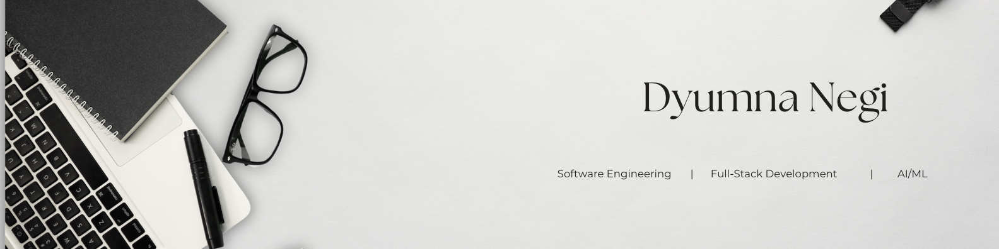

  

###

<h1 align="center">Hey, I'm Dyumna 👋</h1>

<h3 >Software Engineering | Full-Stack Development | AI/ML </h3>

<h3 align="left">👩‍💻  About Me</h3>

###

🎓 Third-year ECE student at IIIT Jabalpur 
💻 Interested in Software Engineering, Full-Stack Development, and AI/ML 
🚀 Built AI-powered and data-driven applications using React, FastAPI, Node.js, and Python 
📈 Solved DSA problems across LeetCode, Codeforces, CodeChef, and GeeksforGeeks 
🏆 LinkedIn CoachIn Mentee | Amazon School of ML Round 2 (results awaited) | Flipkart GridLock Round 2  (results awaited)  

## 🚀 Tech Stack

  

### AI/ML & Computer Vision

  

### Tools & Platforms

  

<h3>📫 Connect With Me</h3>

###
